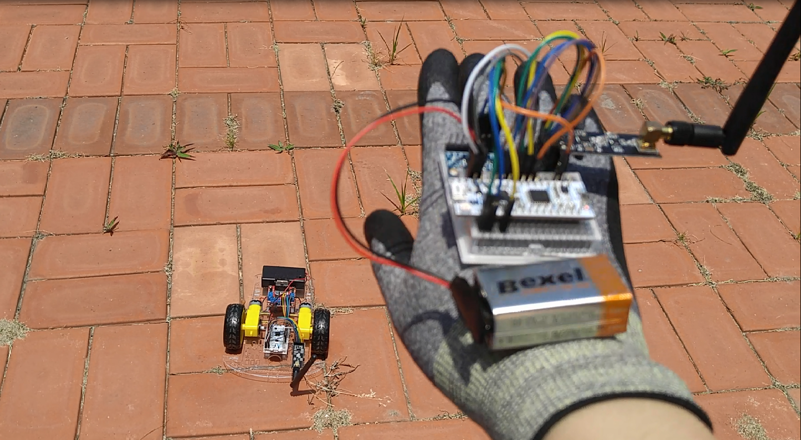
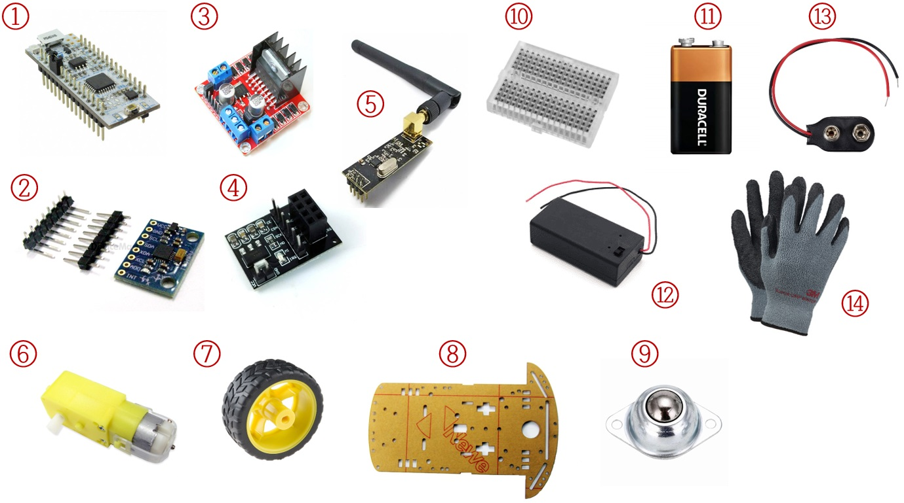
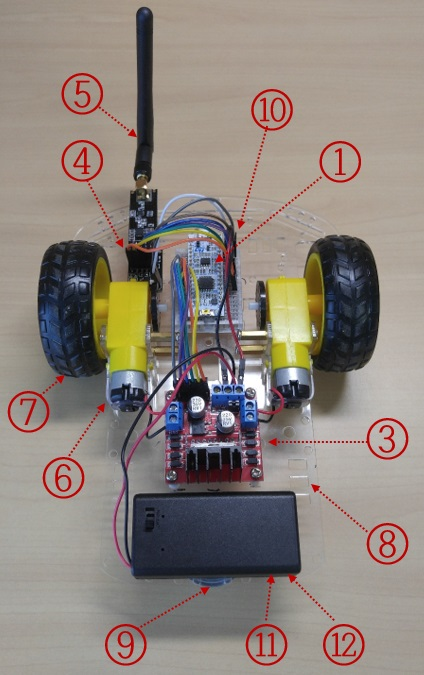
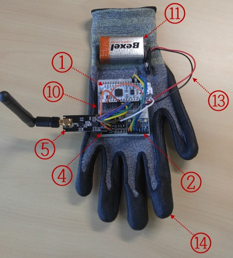
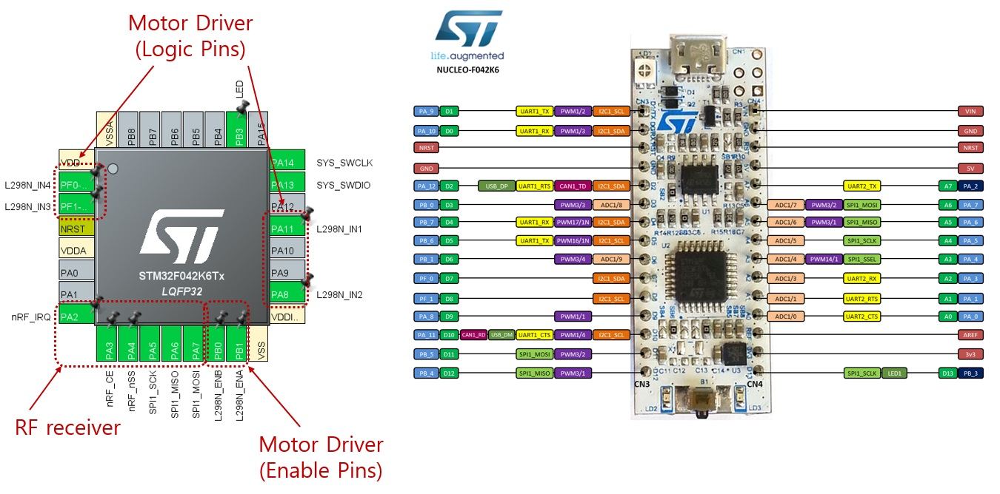
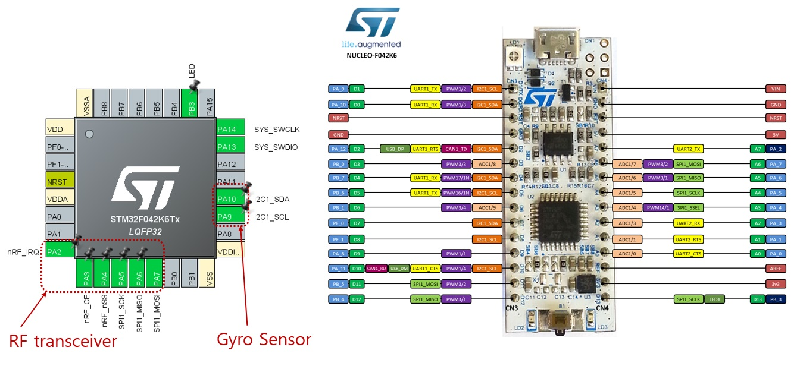

# Gesture Control RC Car

This was probably my first development project at college. The picture below was taken in 2018, when I demonstrated the final product for the embedded system course. Sadly I couldn't keep any video clips though, these resources occasionally remind me of the vitality and dynamic sway of the little thing came out from my hands. This is one of the proudest moments of my life, letting me feel the great joy of programming.

Some components could be out of production for now, or STM32 IDE does not support the program libraries for several drivers any longer.

## Table Of Contents

- [Description](#description)
- [Materials](#materials)
- [Configuration](#configuration)
- [Reference](#reference)

## Description
A very simple and easy homemade gesture-controlled robot is now available! This STM-based RC car detects movement and direction of one's hand and wirelessly operate according to its gesture.

## Materials

1.  **NUCLEO borad F042K6** x2
2.  **MPU 6050 gyroscope module** x1
3.  **L298 motor driver module** x1
4.  **NRF24l01 adapter module** x2
5.  **NRF24L01 Antenna Wireless Transceiver module** x2
6.  **DC geared motor** x2
7.  **65mm rubber wheel** x2
8.  **acrylic car frame** x1
9.  **ball caster** x1
10. **mini breadboard** x2
11. **9 Volt Alkaline battery** x2
12. **9 Volt battery holder** x1
13. **snap-type 9 Volt battery clip** x1
14. **3M coating gloves** x1

#### Final product looks like below.

 

## Configuration

#### For RC car:

#### For glove:

## Reference
**Example Demo Clip** https://www.youtube.com/watch?v=RTJ33EWmTRI 
**STM32-F042K6 Datasheet** https://www.st.com/en/evaluation-tools/nucleo-f042k6.html
